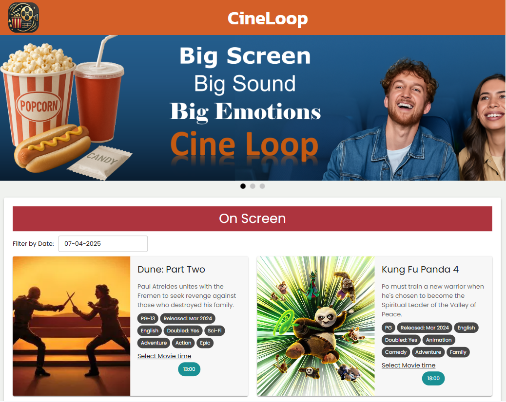

🌐 Lenguajes Disponibles: [Ingles](readme.md)

# 🎬 Sistema de Reservación para Cine

Esta es una aplicación para la reserva de boletos de cine que permite a los usuarios consultar las funciones disponibles, seleccionar películas y elegir los asientos que deseen. Luego, pueden proceder al pago en línea (simulado) y obtener sus tiquetes con opción de visualización y descarga.
El proyecto fue diseñado con el objetivo de simular un sistema real de reservas en un cine, y aplica tecnologías modernas de desarrollo fullstack en un flujo completo que abarca frontend, backend y persistencia de datos.

[Movie theater Live demo](https://movie-theater-87qg.vercel.app/)

## ✨ Principales Características

- 🎞️ **Catálogo de películas**: Visualiza películas en cartelera y las proximas a estrenar con detalles como sinopsis, duración y horarios disponibles

- 🗓️ **Funciones por día**: Consulta todas las funciones disponibles para una fecha específica. Selecciona la función que desee y continue con la reserva de los asientos

- 🪑 **Selección interactiva de asientos**: Elige asientos disponibles directamente desde un mapa visual de la sala con tiempo limite para liberar los asientos si se demora en realizar la reserva

- ⏱️ **Selección de asientos en tiempo real**: El sistema actualiza en vivo la disponibilidad de asientos, indicando cuáles ya han sido reservados por otros usuarios y bloqueando temporalmente los que están en proceso de compra

- ❗ **Limitación de reservas por usuario**: Cada usuario puede reservar hasta 5 asientos por sesion y 10 asientos por función para garantizar disponibilidad equitativa

- 💳 **Validación de tarjeta y simulación de pago**: valida del número de tarjeta ingresado asegurando que el formato sea correcto antes de procesar el pago. Aunque no se conecta con una pasarela real, simula el flujo completo de pago para proporcionar una experiencia realista de compra.

  #### ⚠️ Aviso importante: No ingreses información real de tarjetas de crédito u otros datos personales sensibles, esta aplicación simula el proceso de pago con numeros de tarjetas ficticios.

  | Número de Tarjeta          | Resultado                |
  | -------------------------- | ------------------------ |
  | XXXX-XXXX-XXXX-XXX (0 a 5) | Transacción Exitosa ✅   |
  | XXXX-XXXX-XXXX-XXX (6 a 9) | Transacción Rechazada 🚫 |

- 🎟️📩 **Boletos disponibles para descargar o enviar por correo**: Los boletos pueden ser visualizados y descargados en PDF, o pueden ser enviarlos directamente al emial deseado

- 📱 **Interfaz adaptable**: La aplicación tiene una interfaz responsive, lo que garantiza una experiencia fluida tanto en dispositivos móviles como en pantallas de escritorio.

## 🔑 Conceptos Claves

#### Backend

- Separación del proyecto en desarrollo Frontend y Backend
- Uso de api RESTful y de apis de terceros, validación de requests y middlewares personalizados
- Estructura modular con la separación de rutas, conroladores y validadores.
- Uso de sockets y comunicaciones en tiempo real para actualizar asientos reservados.
- Modelado de Base de datos relacional, relaciones entre entidades, queries y transactions.
- Generación de PDF y envio de emails.
- Uso de variables de entorno separadas en archivo .env

#### Frontend

- Uso de SPA y multiples paginas con React Router, protección de rutas y error boundaries.
- Manejo de libreria de componentes MUI con stilos condicionales.
- Uso de hooks y custom hooks, states, effects, context y renderizado condicional.
- Validación de formularios.
- Diseño Responsive con CSS y hooks media query.

## 🔧Tech Stack

A continuación las principales herramientas usadas

| Área                | Librerias                                                                                                                                                                                                                                                                                              |
| ------------------- | ------------------------------------------------------------------------------------------------------------------------------------------------------------------------------------------------------------------------------------------------------------------------------------------------------ |
| **🧱 Frontend**     | - Typescript y Vite - React  - MUI: Libreria de componentes  - React Router  - React Hot Toast: Cool Notificaciones  - Socket.IO client: Actualización de asientos en tiempo real                                                                                                    |
| **🏗️ Backend**      | - Typescript  - NodeJS y Express  - Express Validator: Validación de requests  - JWT y Bcrypt: Autenticación de usuarios  - Socket.IO: Actualización de asientos en tiempo real  - Multer y Nodemiler: Envio de email con tickets adjuntos  - node-postgres: Comunicación con DB  |
| **🗄️Base de Datos** | - PostgreSQL                                                                                                                                                                                                                                                                                        |

## 🔌 APIs Utilizadas

- 💳 **Credit card validation API**: Usada para validar el número de las tarjjetas de credito e la entidad que las expide. https://algobook.info/docs/credit-card-api
- 🕵️‍♂️ **Random user generator**: Utilizada para crear usuarios ficticios de manera automática. Ideal para pruebas o demostraciones sin necesidad de ingresar información personal real, como correos electrónicos. https://randomuser.me/

## Estructura de la Base de Datos

La base de datos tiene varias tablas relacionadas entre ellas para crear las reservas y la gestión de las peliculas, esta preparada para poder recibir cambios como agregar salas nuevas, nuevos horarios de funciones, peliculas proximas a estrenar.

- 🎬 Peliculas: titulo, descripción, duracion, estado(cartelera o estreno), rating, lenguaje, chips(información util)
- 🪑 Auditorios: nombre, total de sillas, filas, columnas
- 🕒 Horarios: pelicula(fkey), auditorio(fkey), fecha, hora, precio por silla, impuestos por silla
- 🎟️ Reservaciones: horario(fkey), usuario(fkey), estado(pendiente, reservado), fecha expiración, silla, sesion del usuario
- 🧑‍💼 users: nombre, email, clave(encriptada), nivel (cliente, admin)

#### ⚠️ Nota: No se almacena información de tarjetas de credito

Script para creat tablas en la base de datos: **backend/Database_template.sql**

## Para ejecutar localmente

1. Crear base de datos con el archivo **backend/Database_template.sql**
2. Crear archivo .env en backend:

   - Base de datos: DB_USERNAME, DB_PASSWORD, DB_HOST, DB_PORT, DB_DBNAME

   - Servidor: SERVER_PORT, JWT_SECRET

   - Servidor email: Se usa nodemailer, MAIL_USER, MAIL_API_KEY, MAIL_SERVER, MAIL_PORT

3. Crear archivo .env en frontend:

   - VITE_BASE_URL: {servidor : puerto}/api/v1

   - VITE_BASE_IO_URL: {servidor : puerto}

4. En las carpetas **backend** y **frontend** ejecutar `npm install` y `npm run dev`, o crear la imagen de Docker con dockerfile
5. Crear archivo compose para crear los containers y ejecutar `compose up`

## 🚀 Futuras mejoras y adiciones

Estas son algunas funcionalidades que podrían añadirse en el futuro para enriquecer la experiencia:

- 🧑‍💼 **Panel administrativo**: Creación de un panel para agregar nuevas peliculas, horarios, salas y visualizar estadisticas sobre la ocupación de las salas.
